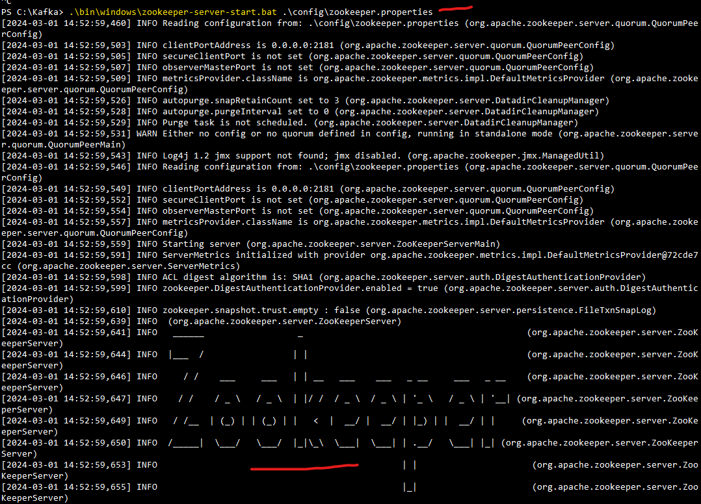
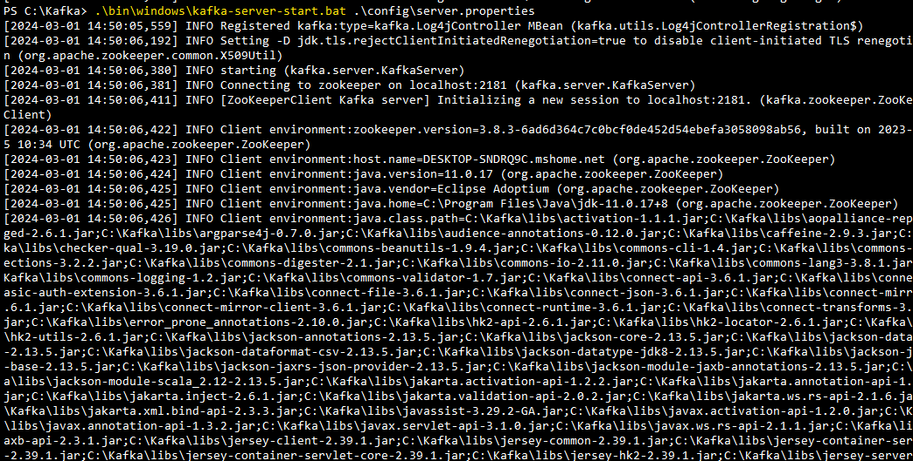
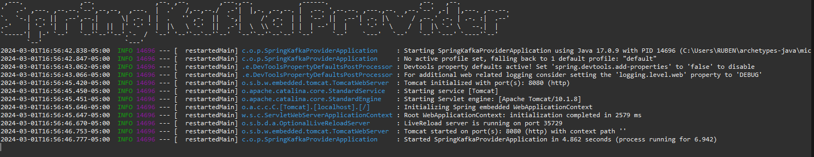
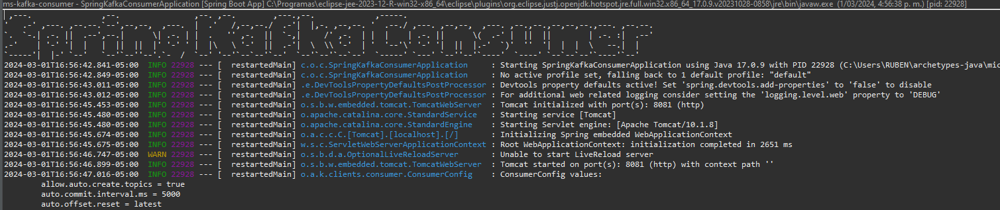
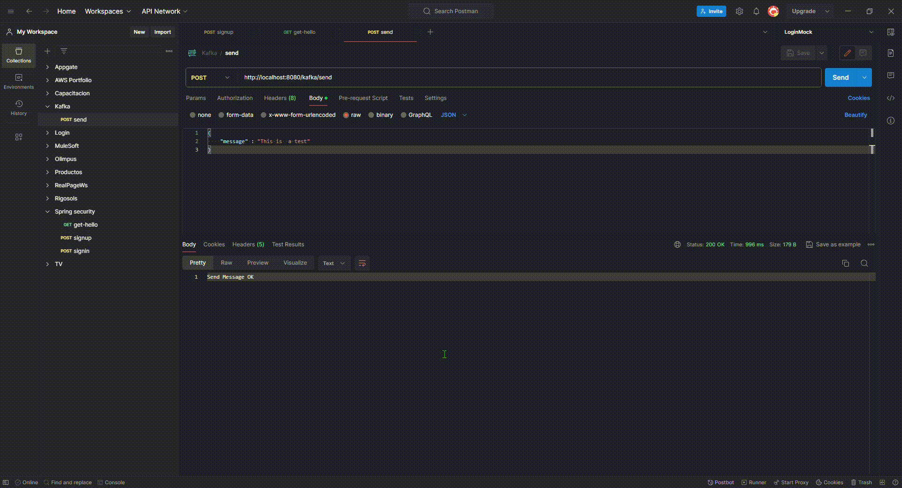
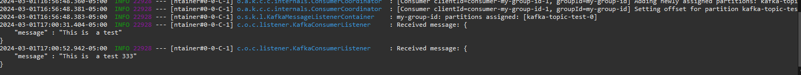

# Micro Spring Kafka

Spring Kafka integration

## Tech Stack

**Java:** 17

**Spring:** 3.0.6

**Spring Kafka** 

**Kafka:** 3.6.1

## 1. Installation

# 1.1 Configure Kafka server

**Download Kafka server: ** https://kafka.apache.org/downloads

**Init Zookeeper service: **

```bash
.\bin\windows\zookeeper-server-start.bat .\config\zookeeper.properties
```



**Init Kafka service: **

```bash
.\bin\windows\kafka-server-start.bat .\config\server.properties
```



**Create a new Topic into Kafka Server: **

```bash
.\bin\windows\kafka-topics.bat --create --topic kafka-topic-test --bootstrap-server localhost:9092
```


# 1.2 Configure Project

Install ms-spring-sec with maven

```bash
  mvn clean install micro-kafka
```

**Parent Project: ** micro-kafka

**Modules: ** ms-kafka-consumer, ms-kafka-provider


## 2 Deployment

To deploy this project run spring boot






## 3 Test

To Test import the postman collection

/micro-kafka/Kafka.postman_collection.json





## Authors

- [@Rubencho](https://github.com/rubenchomazo/)


## References

- [@UnProgramadorNace](https://github.com/UnProgramadorNace/Spring-Apache-Kafka) 
